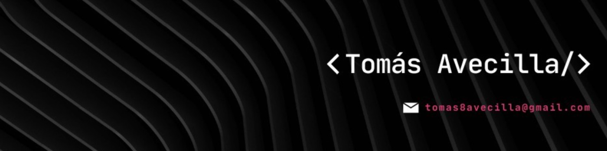

<!-- Título y Presentación -->
# 👋 Hi, I'm Tomas Avecilla

  

Welcome to my GitHub profile! I'm passionate about the world of Computer Science and Technology, and I'm on an exciting journey to explore the realms of Data Science and Artificial Intelligence. 🚀

<!-- Áreas de Interés -->
## 👀 What I'm Interested In

- Data Science
- Artificial Intelligence

<!-- Mis Habilidades -->
## 💻 My Skills
- Programming Languages: Python, Rstudio
- Data Analysis: Pandas, Statsmodels, Networkx
- Databases: SQL Languaje, SQL Server, Visual Studio SSIS, Power BI
- Version Control: GIT
- API: FastAPI

## 🚀 Featured Projects

Here are some of the exciting projects I've been working on:

1. [Data Analysis with pandas](https://github.com/Tomas8x/Analisis-de-datos-con-Pandas): Data cleaning, transformation, and visualization
2. [DataWarehouse](https://github.com/Tomas8x/Datawarehouse---SSIS): ETL with VS, SSIS, and SQL Server + some PBI Dashboards.
3. [Application Programming Interface](https://github.com/Tomas8x/API-Servidor-y-Cliente): FastAPI Project.

<!-- ¿Cómo Pueden Contactarme? -->
## 📫 How to Reach Me

I'm open to collaboration, discussions, and new opportunities. If you'd like to get in touch with me, please feel free to reach out via email: [tomas8avecilla@gmail.com](mailto:tomas8avecilla@gmail.com).

<!-- Estadísticas de GitHub
## 📊 GitHub Stats

<!-- Contribuciones a Proyectos de Código Abierto
## 🌐 Open Source Contributions

I love contributing to open-source projects. Here are some notable projects I've contributed to:

- [Project Name](link_al_proyecto): Describe your contributions and involvement.
- [Project Name](link_al_proyecto): Highlight your contributions to another open-source project. -->
<!-- Agradecimientos y Cierre -->
Thank you for visiting my GitHub profile! If you're interested in collaboration, projects, or just want to chat about tech, don't hesitate to connect with me 😃
